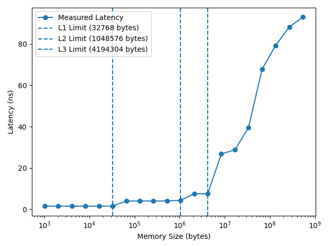
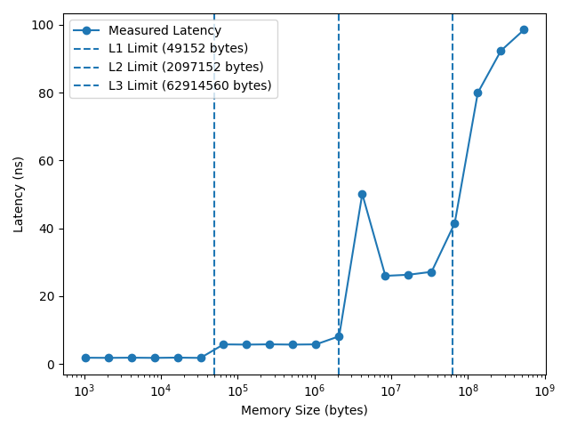
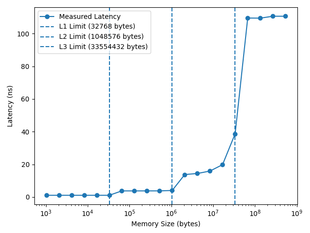
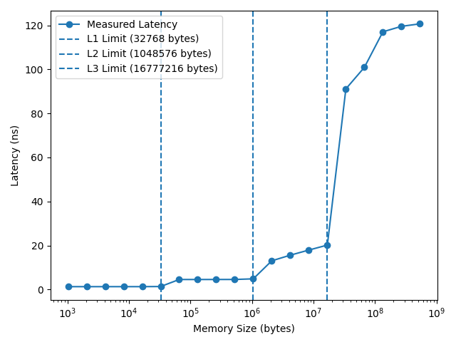
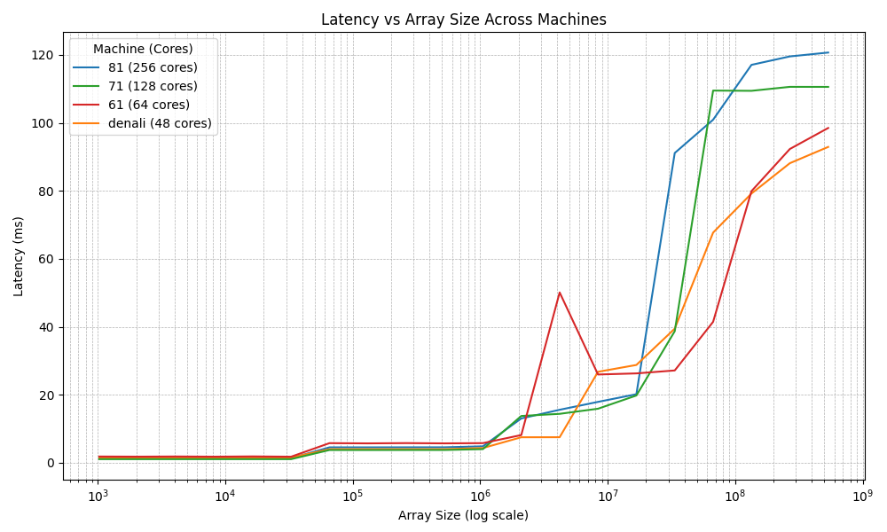

# Pointer Chase

Pointer-chase set up for measuring cache/dram access latency. Original source from https://github.com/bsc-mem/Mess-benchmark.

## Procedure:
1. Ensure `perf` and huge pages are configured. Follow the instructions below.
2. Details about the system are filled in `stats_{name}.txt` file. This includes information on the cache hierarchy and cache line size. See `stats_denali.txt` files for an example.
3. Run `run.sh {name}` to run the script with the configuration file. For each level of the memory hierarchy, the script computes the appropriate pointer chase array size, generates the walk and loop, and also runs the benchmark. It reads the results and puts it in `results_{name}.csv`. All this is done for 10 iterations for each level.
4. For each iteration, a random walk array is generated of appropriate size. We investigate varying array sizes (in powers of two).
6. The actual pointer-chase is then run. In the walk array, each index holds the next index to jump to–thus, by traversing through the walk array, we randomly jump around in a block of memory that spans the size of the walk array.
7. Hardware counters are used to record the number of cycles that the pointer-chase executed for, and timers record the duration. We simply take the duration and divide by the number of loads to derive the memory access latency. You can use hardware counters to account of TLB overhead, but we found that doing so added complexity to the portability of the benchmark, and also had very little effect on the results (especially with huge pages enabled).

## Requirements:
`perf` and `numactl` should be installed. The following configurations should also be added.

```bash
# perf event paranoid, huge pages
echo -1 > /proc/sys/kernel/perf_event_paranoid
sysctl -w vm.nr_hugepages=1024
```

Disabling HW Prefetchers:
_Be sure to confirm registers and values before setting them._
AMD:
```bash
sudo modprobe msr
# disable prefetching into L2 cache
sudo wrmsr -a 0xc0011022 0xc000000401510000
sudo wrmsr -a 0xc001102b 0x2000cc14
```

Intel:
```bash
sudo modprobe msr
sudo wrmsr -a 0x1a0 0x60628e2289    # Disable hw prefetching
sudo wrmsr -a 0x1A4 0xf             # Disable L1, L2 cache prefetching
```

Power:
```bash
dscrctl -n -s 1         # aix
ppc64_cpu --dscr=1      # linux
```

## Results:
Denali:



keg 61:



keg 71:



keg 81:



Overall results:



Steep jumps in latency access indicate crrossing the memory load of varying levels of the memory hierarchy. The emperical results align with the derived accessible cache sizes for each core (total aggregate cache size, divided by number of instances). We observe steep jumps in latency, across these computed boundaries.

Furthermore, results show that increased core count (which indicates larger chips) increases DRAM access time. This indicates that the cost of traversing throughout a larger interconnect can be substantial. This points to measuring interconnect latency as a next step.


